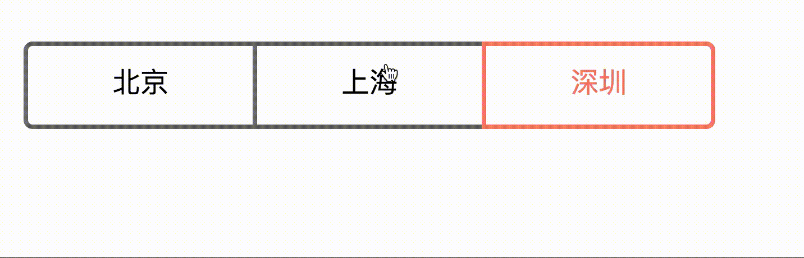

## tabs实现切换

🎉 ### 未选中下

* 在每个Item设置边框，但取消左边框
* 选中第一个Item，并设置左边框
* 给除了第一个的其他Item设置before内容：添加一竖杆 z-index:1

🎉 ### 被选中时

* 修改每个边框的颜色
* 修改除了第一个的其他Item设置before内容的颜色
* PS: 因为有后面一Item的竖杆挡在前面，因此需要加上box-shadow

